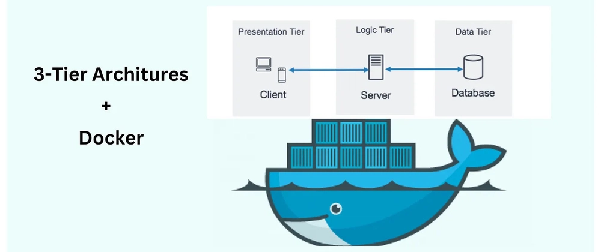

# Three-Tier PHP Registration Form — Docker Deployment

## Overview

The __Three-Tier PHP Registration Form — Docker Deployment__ project demonstrates a fully containerized, production-style web application using a 3-tier architecture. It separates the application into __Presentation (Frontend), Application (PHP Backend), and Database (MySQL)__ tiers — each running in isolated Docker containers for maximum scalability, portability, and modularity.



Three tiers used
* __Web (Reverse proxy / static files)__ — Nginx serving static assets and forwarding PHP requests to PHP-FPM.

* __Application (PHP-FPM)__ — PHP runtime that executes the registration form logic.

* __Database (MySQL)__ — Relational database that stores registered user data.

This README explains folder structure, how to build and run locally with Docker, how the services communicate, and production considerations.

## Step-by-Step Setup
### Step 1: Launch EC2 Instance
Launch an Amazon Linux EC2 instance.
Connect to it via SSH:

```bash
ssh -i <YOUR_KEY_PEM>.pem ec2-user@<EC2-Public-IP>
```
### Step 2: Install Docker & Docker Compose
```bash
sudo yum update -y
sudo amazon-linux-extras install docker -y
sudo systemctl start docker
sudo systemctl enable docker
sudo usermod -aG docker ec2-user
```
__Install Docker Compose:__
```
sudo curl -L "https://github.com/docker/compose/releases/latest/download/d
ocker-compose-$(uname -s)-$(uname -m)" -o /usr/local/bin/docker-compos
e
sudo chmod +x /usr/local/bin/docker-compose
docker-compose --version
```
Logout and login again to apply the group changes.

### Step 3: Create Project Structure
```bash 
mkdir -p /home/ec2-user/threetier/{web,app,db}
cd /home/ec2-user/threetier
mkdir -p web/{code,config}
mkdir -p app/code
```
###  Folder structure

.png)

### Step 4: Prepare Web Tier (Nginx)
(a) Get the default Nginx configuration

Create a temporary container to copy the default config:
```bash 
docker run -d --name temp-nginx nginx
docker exec -it temp-nginx cat /etc/nginx/conf.d/default.conf > web/config/d
efault.conf
docker rm -f temp-nginx
```
__(b) Edit the default.conf file
Open and edit:__
```bash
vim web/config/default.conf
```

Replace the PHP block with this configuration:
```bash 
location ~ \.php$ {
 root /app;
 fastcgi_pass app:9000;
 fastcgi_index index.php;
 fastcgi_param SCRIPT_FILENAME /app/$fastcgi_script_name;
 include fastcgi_params;
}
```

### Step 5: Create Frontend (Signup Form)
File: ```/web/code/signup.html```

```html
<!DOCTYPE html>
<html>

<head>
    <title>Signup Form</title>
    <style>
        body {
            font-family: Arial, sans-serif;
            background: #eef2f7;
            margin: 0;
            padding: 40px;
            display: flex;
            justify-content: center;
            align-items: center;
        }

        .form-container {
            background: #fff;
            padding: 25px 35px;
            border-radius: 12px;
            width: 420px;
            box-shadow: 0 5px 18px rgba(0, 0, 0, 0.12);
            animation: fadeIn 0.7s ease-in-out;
        }

        h2 {
            text-align: center;
            color: #333;
            margin-bottom: 25px;
        }

        label {
            font-weight: bold;
            color: #555;
        }

        input[type="text"],
        input[type="email"],
        input[type="url"],
        textarea {
            width: 100%;
            padding: 10px;
            margin-top: 6px;
            margin-bottom: 18px;
            border: 1px solid #ccc;
            border-radius: 6px;
            font-size: 15px;
        }

        input[type="radio"] {
            margin-right: 8px;
        }

        .gender-label {
            margin-right: 15px;
            font-size: 15px;
        }

        input[type="submit"] {
            width: 100%;
            padding: 12px;
            background: #3498db;
            border: none;
            color: white;
            font-size: 16px;
            border-radius: 6px;
            cursor: pointer;
            transition: 0.3s;
        }

        input[type="submit"]:hover {
            background: #2980b9;
        }

        @keyframes fadeIn {
            from {
                opacity: 0;
                transform: translateY(20px);
            }

            to {
                opacity: 1;
                transform: translateY(0);
            }
        }
    </style>
</head>

<body>

    <div class="form-container">
        <h2>Signup Form</h2>

        <form action="submit.php" method="post">

            <label>Name:</label>
            <input type="text" name="name" required>

            <label>Email:</label>
            <input type="email" name="email" required>

            <label>Website:</label>
            <input type="url" name="website">

            <label>Comment:</label>
            <textarea name="comment" rows="4"></textarea>

            <label>Gender:</label><br><br>

            <label class="gender-label">
                <input type="radio" name="gender" value="female" required> Female
            </label>

            <label class="gender-label">
                <input type="radio" name="gender" value="male"> Male
            </label>

            <label class="gender-label">
                <input type="radio" name="gender" value="other"> Other
            </label>

            <br><br>

            <input type="submit" value="Submit">
        </form>
    </div>

</body>

</html>

```

### Step 6: Create Application Tier (PHP-FPM)
File: ```/app/code/submit.php```

```php
<?php 
error_reporting(E_ALL); 
ini_set('display_errors', 1); 

$name = $_POST['name']; 
$email = $_POST['email']; 
$website = $_POST['website']; 
$comment = $_POST['comment']; 
$gender = $_POST['gender']; 

// Database connection 
$servername = "db"; 
$username = "root"; 
$password = "rootpass"; 
$dbname = "studentapp"; 

// Create connection 
$conn = mysqli_connect($servername, $username, $password, $dbname); 

// Check connection 
if (!$conn) { 
    die("Connection failed: " . mysqli_connect_error()); 
} 

// Insert query 
$sql = "INSERT INTO users (name, email, website, comment, gender) 
        VALUES ('$name', '$email', '$website', '$comment', '$gender')"; 
?> 

<!DOCTYPE html>
<html>
<head>
<title>Form Submission Result</title>

<style>
    body {
        font-family: Arial, sans-serif;
        background: #f4f6f9;
        padding: 40px;
        margin: 0;
        display: flex;
        justify-content: center;
    }
    .card {
        background: #fff;
        padding: 30px;
        border-radius: 12px;
        width: 600px;
        box-shadow: 0 5px 20px rgba(0,0,0,0.12);
        animation: fadeIn 0.6s ease-in-out;
    }
    h2 {
        color: #2ecc71;
        text-align: center;
    }
    h3 {
        color: #333;
    }
    ul {
        list-style: none;
        padding: 0;
    }
    ul li {
        padding: 10px 0;
        border-bottom: 1px solid #eee;
        font-size: 16px;
    }
    ul li strong {
        color: #34495e;
    }
    .error {
        color: #e74c3c !important;
        text-align: center;
    }
    .btn {
        display: block;
        margin: 25px auto 0;
        width: 200px;
        text-align: center;
        padding: 12px;
        background: #3498db;
        color: white;
        border-radius: 6px;
        text-decoration: none;
        transition: 0.3s;
        font-size: 16px;
    }
    .btn:hover {
        background: #2980b9;
    }
    @keyframes fadeIn {
        from { opacity: 0; transform: translateY(20px); }
        to { opacity: 1; transform: translateY(0); }
    }
</style>

</head>
<body>

<div class="card">
<?php 
if (mysqli_query($conn, $sql)) { 
    echo "<h2>✅ New record created successfully!</h2>"; 
    echo "<h3>Submitted Information:</h3>"; 
    echo "<ul>"; 
    echo "<li><strong>Name:</strong> " . htmlspecialchars($name) . "</li>"; 
    echo "<li><strong>Email:</strong> " . htmlspecialchars($email) . "</li>"; 
    echo "<li><strong>Website:</strong> " . htmlspecialchars($website) . "</li>"; 
    echo "<li><strong>Comment:</strong> " . htmlspecialchars($comment) . "</li>"; 
    echo "<li><strong>Gender:</strong> " . htmlspecialchars($gender) . "</li>"; 
    echo "</ul>"; 
} else { 
    echo "<h2 class='error'>❌ Error submitting form</h2>";
    echo "<p class='error'>" . mysqli_error($conn) . "</p>"; 
} 

mysqli_close($conn); 
?> 

<a class="btn" href="index.html">⬅ Go Back</a>

</div>

</body>
</html>

```

### Step 7: Create Database Tier
__File:__ ```/db/Dockerfile```

```docker
FROM mysql
ENV MYSQL_ROOT_PASSWORD=root
ENV MYSQL_DATABASE=studentapp
COPY init.sql /docker-enterypoint-initdb.d/
EXPOSE 3306
CMD ["mysqld"]
```

__File:__ ```/db/init.sql```
```sql
CREATE TABLE users (
 id INT PRIMARY KEY AUTO_INCREMENT,
 name VARCHAR(20),
 email VARCHAR(100),
 website VARCHAR(255),
 gender VARCHAR(6),
 comment VARCHAR(100)
);
```
### Step 8: Create Docker Compose File
__File:__ /docker-compose.yml

```yml
services:
  web:
    image: nginx
    ports:
      - "80:80"
    volumes:
      - ./web/code/:/usr/share/nginx/html/
      - ./web/config/:/etc/nginx/conf.d/
    networks:
      - webnet
    depends_on:
      - app
      - db

  app:
    image: bitnami/php-fpm
    volumes:
      - ./app/code/:/app/
    networks:
      - webnet
      - dbnet
    depends_on:
      - db

  db:
    build: ./db/
    volumes:
      - myvolume:/var/lib/mysql
    networks:
      - dbnet

networks:
  webnet:
  dbnet:

volumes:
  myvolume:

```

### Step 9: Start the Containers
```bash
docker-compose up -d
```
Check running containers:
```bash
docker ps
```

### Step 10: Verify Application
Open your EC2 Public IP in a browser:
```bash
 http://<EC2-Public-IP>/signup.html
```
Fill out the form and click Submit.
You should see a confirmation message with the entered data.

### Step 11: Verify Database
To confirm that the data is saved in MySQL:
```
docker exec -it <db_container_id> mysql -uroot -proot studentapp mysql> SELECT * FROM users;
```
### Conclusion
The __Three-Tier PHP Registration Form — Docker Deployment__ project provides a practical and efficient demonstration of how modern applications can be architected, containerized, and deployed using Docker. By separating the frontend, backend, and database into dedicated containers, the setup ensures better scalability, reliability, and maintainability. Docker Compose further simplifies orchestration, making deployments consistent across different environments. Overall, this project not only showcases a clean three-tier architecture but also serves as a strong foundation for learners and developers looking to understand real-world container-based application deployment.
